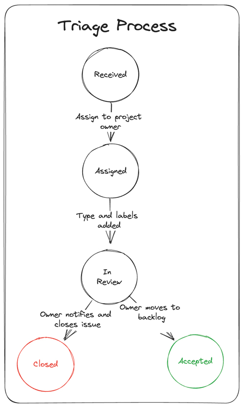
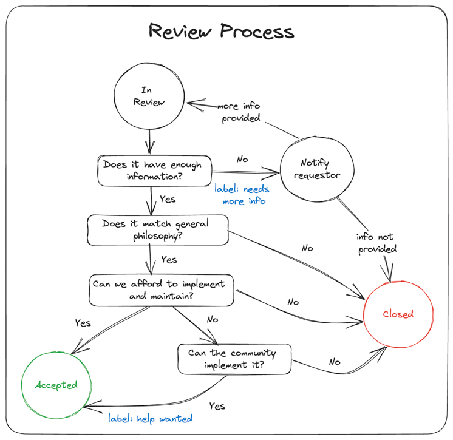

# Triage Process

Triaging is a multi-step process that is performed by the issue tracker and the sub-project/feature owners. The goal of triaging is to provide a clear understanding of what will happen to issues that are opened. For example, after a feature request is triaged, it will be clear whether the issue will be picked up or closed. After an issue is received and triaged, it will either be assigned to the backlog, a specific milestone or closed.

## Goals

The goals for triage are:

* Make triaging decisions easier by defining rules and processes
* Easily prioritize work for each milestone
* Set expectations with the community regarding how issues are handled

## Triaging Flow

Below is the basic flow that an issue goes through. At any step in the flow the issue may be closed.

## Closing Issues

Issues are closed for the following reasons:

| **Reason** | **Label**|
----------------|----------
| Issue is obsolete or fixed | |
| Needed information not received within 7 days| `needs more info` |
| It's a duplicate of another issue| `duplicate` |
| Behavior is as designed| `by-design` |
| Issue is a developer question 1| `dev-question` |
| Issue ia a user question 1 | `question` |
| Issue is not related to the goals of the project so is unactionable | `off-topic` |
| Issue does not contain valid information or was unintended | `invalid` |
| Issue cannot be reproduced based on information given | `not-reproducible` |
| Feature request is out of scope | `out-of-scope` |
| Issue is due to upstream dependency | `upstream` |

1 All questions will be redirected to our [Discord server](https://discord.gg/SRG3ePMKNy)

## Requesting Information

If an issue is missing information that need to understand the issue, a `needs more info` label will be assigned. If the information is not received in 7 days the issue will be closed.

## Categorizing Issues

Each issue will be assigned a **type** label.

|**Type**| **Description**|
:-| :--------
| `needs more info` | issue is missing information so type label cannot be assigned |
| `bug` | the implementation of a feature is not correct |
| `feature-request` | request for a new feature |
| `under-discussion` | not decided whether issue is bug or feature |
| `tech-debt` | improve the implementation/architecture |
| `upstream` | used to track an issue in an upstream dependency |
| `engineering` | issues related to engineering system or processes |
| `polish` | a feature could be improved but not a bug |

## Assigning Feature Areas

Each issue will have a **feature area** label assigned during the triage process.

## Assigning a Milestone

The Radius team plans and executes milestones in 2 week sprints which are incremented numerically. Any item not in the current sprint will be put in the **backlog** milestone. Sprint planning is completed on the first day of the sprint and pulls all items from the backlog. 

## Important Issues

We assign the `important` label to issues that:

* result in data loss
* break basic functionality
* are critical security/performance issues
* are UI issue that makes feature unusable

## Managing Feature Requests

Feature requests are used as a means of communication between the members of the community. Thus, in principle, they could be kept open no matter what will happen to the feature they describe. Unfortunately, this makes it hard to understand what has realistic chances to ever make it into the repository. Therefore, feature requests that cannot be addressed are closed with the `out-of-scope` label. If the feature request meets the goals of the project and could be implemented by the community, the `community` label is assigned.

If you are the author of a feature request you might not like that we close or don't plan to address your request. It might even feel like a slap in your face. We understand that. All of us have been there—in this project or others we have contributed to. So, be assured, we love all of your input. Don't take personal offense when we close it. If you feel your feature request deserves to stay open, improve your use case and ping us or gather more support within the community.

This is our decision making tree.

## Won't Fix Bugs

Bugs will be closed as `wont-fix` if there is a negative cost-benefit to the fix. For example, if the fix is so complex that despite all the tests there is a risk of regression for many users, fixing is not a reasonable choice. When the bug is closed as `wont-fix` there will be a clear explanation as to why the decision was made.

## Upstream Issue

The `upstream` label indicates that the issue is in a package or library that we consume and cannot fix independently. An upstream issue is closed when we can establish a clear traceability link between the issue in our repository and an issue in the issue tracker of the package or library.
